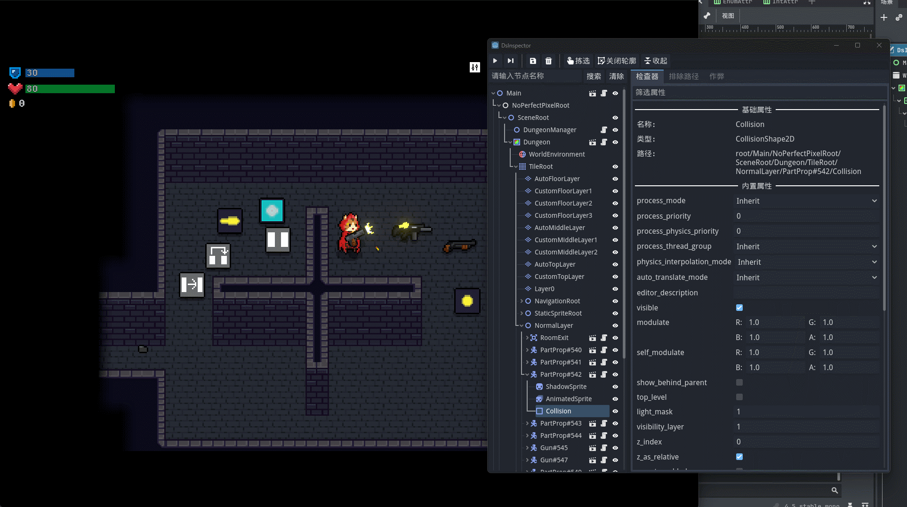
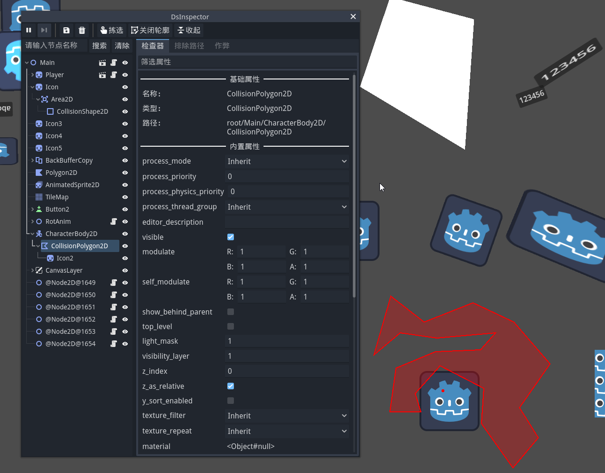
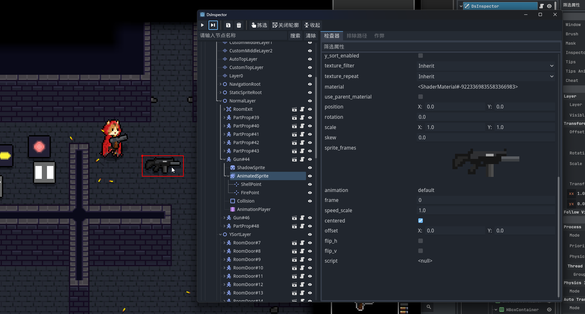

# DsInspector

[English](README.md)|[中文](README_zh.md)

**DsInspector (Developer Support Inspector)** is a runtime debugging plugin for **Godot 4**, allowing you to view and modify nodes and properties in the scene tree in real time while the game is running.
 It provides functionality similar to the editor’s Inspector, making debugging and testing more convenient and intuitive.


## Features

- **Real-time Node Tree Viewer**: Displays all nodes in the currently running scene.
- **Node Property Inspector**: Supports viewing and modifying node property values (including script-exported variables). Changes take effect immediately.
- **Node Search**: Quickly locate target nodes.
- **Node Selection Highlighting**: Locate selected nodes in the game view. After choosing “Pick Node,” click an element in the scene to select its node. If elements are stacked, clicking repeatedly will cycle through them.
- **Exclude Paths**: Filter specified paths to quickly locate nodes.
- **Open Script/Scene Path**: In the property panel, quickly open the associated script or locate the scene file in the file system, making it easy to jump to the source file.
- **Save Node as Scene**: Export selected nodes and save them as new scenes (e.g., `.tscn`) for reuse and sharing.
- **Cheat Button**: Quickly add cheat buttons via `DsInspector.add_cheat_button()`.

## Supported Versions

This plugin is developed and tested for the Godot 4.2+ series and does not support earlier versions.

For Godot 3.x usage, please refer to this repository: https://github.com/xlljc/DsInspector_GD3

## Installation

1. Clone this repository and copy the `addons/` folder into your Godot project’s `addons/` directory.
2. Enable the plugin in `project.godot`:
   - Open `Project > Project Settings > Plugins`
   - Find `DsInspector` and enable it
3. After running the game, a floating window will automatically appear. Click the floating window to open the inspector.

If you need the plugin to use the native Windows window, you can use the following code to enable it when starting the game:

```gdscript
get_viewport().gui_embed_subwindows = false
```

## Screenshots








## License

This project uses the **MIT License**.
