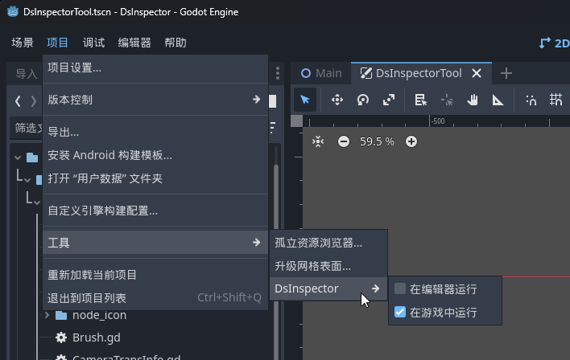

# DsInspector

[English](README.md) | [中文](README_zh.md)

**DsInspector (Developer Support Inspector)** is a **Godot 4** runtime debugging plugin that allows you to **view and modify nodes and properties in the scene tree in real time** while the game is running.
It provides functionality similar to the built-in Editor Inspector, making debugging and testing much more intuitive and convenient.


## Features

* **Real-time Node Tree View**: Displays all nodes in the currently running scene. (Only supports 2D scene inspection; 3D scenes are not supported.)
* **Node Property Inspection**: View and modify node property values (including script-exported variables). Changes take effect immediately.
* **Node Search**: Quickly find target nodes.
* **Node Selection Highlight**: Locate the selected node in the game viewport.
  When "Pick Node" is enabled, click on an element in the scene to select it.
  If elements overlap, repeatedly clicking cycles through them.
* **Exclude Paths**: Filter out specific node paths to help focus on target nodes more easily.
* **Frame-by-Frame Execution**: Pause the game and advance it one frame at a time.
* **Open Script/Scene Path**: In the property panel, quickly open the associated script or locate the scene file in the file explorer—making it easy to jump to source files.
* **Save Node as Scene**: Export and save the selected node as a new scene (e.g. `.tscn`), useful for reuse or sharing.
* **Cheat Buttons**: Quickly add custom cheat/debug buttons via `DsInspector.add_cheat_button()`.
* **Auto-Disable on Export**: The plugin is active only when running the game from the editor; all features are automatically disabled in exported builds—no extra setup required.
* **C# Support**: Fully compatible with C# projects.
  The plugin automatically recognizes C# scripts and `[export]` attributes—no extra configuration needed.
* **Run in Godot Editor**: Allows the plugin to run inside the Godot Editor itself, enabling real-time inspection of internal editor nodes.
  This is especially helpful for developing editor plugins (feature not supported in the 3.x version).

## Supported Versions

This plugin is developed and tested for **Godot 4.2+**.
Older versions are **not supported**.

For Godot 3.x, please use this repository instead:
👉 [https://github.com/xlljc/DsInspector_GD3](https://github.com/xlljc/DsInspector_GD3)

## Installation

1. Clone this repository and copy the `addons/` folder into your project’s `addons/` directory.
2. Enable the plugin in your `project.godot` settings:

   * Open **Project > Project Settings > Plugins**
   * Find **DsInspector** and enable it
3. After running the game, a floating window will appear. Click the window to open the inspector.
4. You can also enable or disable the plugin for the editor or the game from **Project → Tools → DsInspector**.



If you prefer the plugin to use a **native OS window**, add the following line when starting the game:

```gdscript
get_viewport().gui_embed_subwindows = false
```

## Preview

Pick objects directly in the scene:


Inspect Godot editor nodes:


Display collision shapes:


Display textures:


## C# Projects

In C# projects, you can use the following wrapper class to conveniently add **cheat buttons**.

```csharp
using Godot;

/// <summary>
/// Provides static methods for interacting with the DsInspector singleton,
/// allowing you to add cheat/debug buttons.
/// This class must be initialized after the SceneTree is created
/// by calling the <see cref="Init(SceneTree)"/> method.
/// </summary>
public static class CheatManager
{
    private static SceneTree _tree;
    private static Node _dsInspector;

    /// <summary>
    /// Initializes the CheatManager with a SceneTree instance.
    /// </summary>
    public static void Init(SceneTree tree)
    {
        _tree = tree;
        _dsInspector = null;
    }

    private static Node GetDsInspector()
    {
        if (_tree == null)
        {
            GD.PrintErr("CheatManager is not initialized. Please call CheatManager.Init(SceneTree tree) first.");
            return null;
        }
        if (_dsInspector == null)
            _dsInspector = _tree.Root.GetNodeOrNull("DsInspector");
        return _dsInspector;
    }

    /// <summary>
    /// Adds a cheat button to DsInspector by invoking the GDScript singleton method.
    /// </summary>
    public static void AddCheatButton(string title, Node target, string method)
    {
        var dsInspector = GetDsInspector();
        if (dsInspector != null)
            dsInspector.Call("add_cheat_button", title, target, method);
    }

    /// <summary>
    /// Adds a cheat button to DsInspector using a Callable.
    /// </summary>
    public static void AddCheatButtonCallable(string title, Callable callable)
    {
        var dsInspector = GetDsInspector();
        if (dsInspector != null)
            dsInspector.Call("add_cheat_button_callable", title, callable);
    }
}
```


## License

This project is licensed under the **MIT License**.
